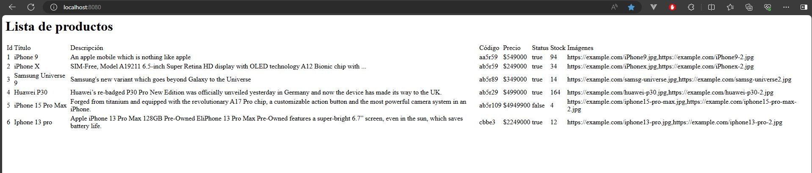
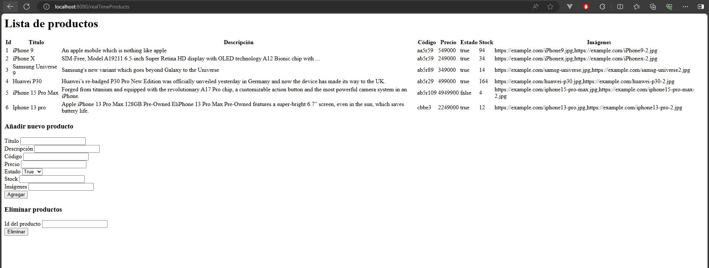
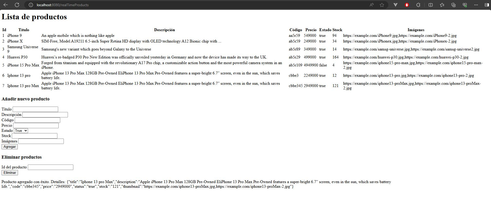
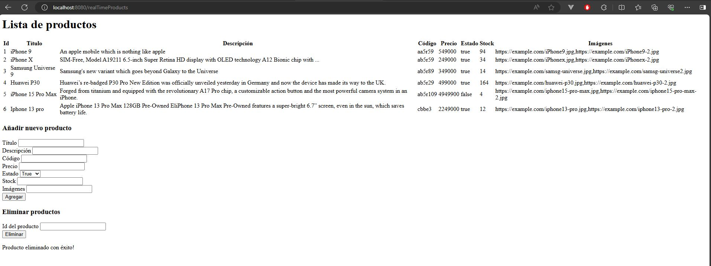

Ecommerce Backend - Curso Coderhouse

En la segunda preEntrega del curso de Backend cuya comisión 69960, se realiza la siguiente consigna:

- Crear una vista "home" donde se muestren todos los productos:
  
- Crear una vista "realTimeProducts" donde se muestren los productos, se puedan agregar y eliminar también:
  
- Que la vista "realTimeProducts" funcione con websockets y se actualice automáticamente:
  -Añadir producto:
  
  -Eliminar producto:
  
