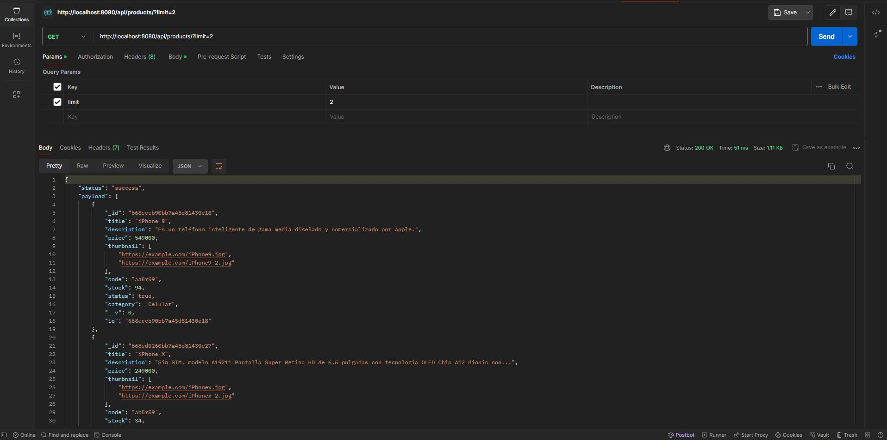
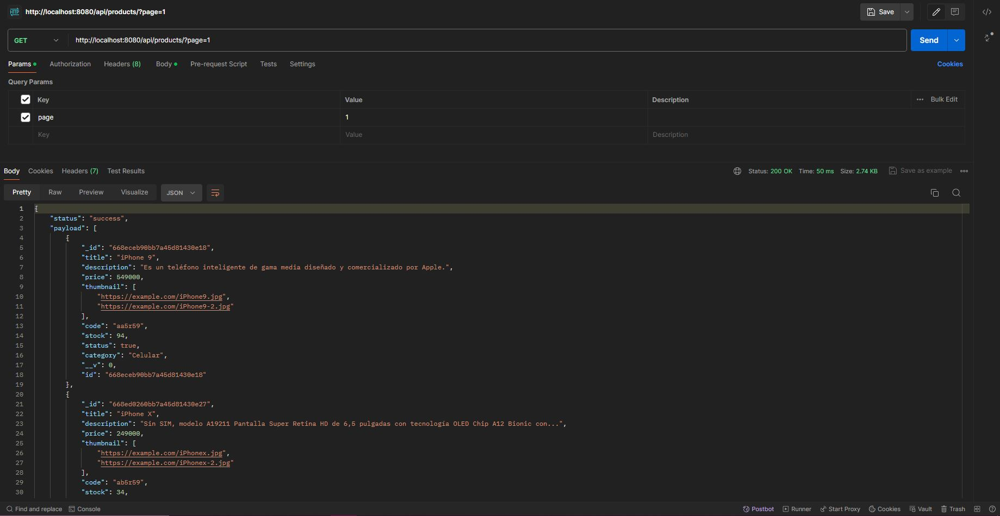
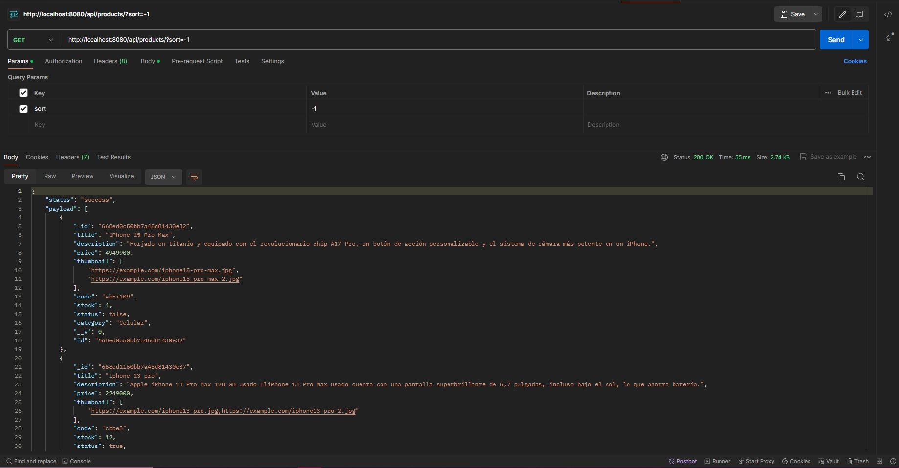
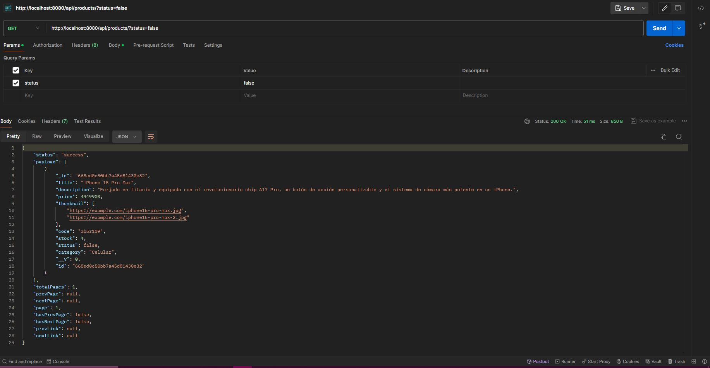
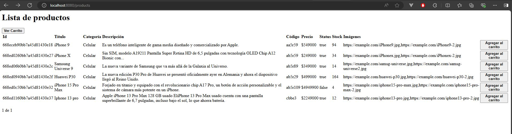
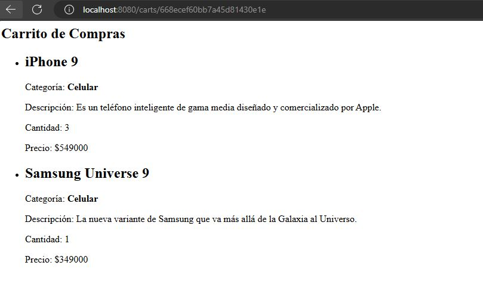

Ecommerce Backend - Curso Coderhouse

En la entrega final del curso de Backend (Parte 1) cuya comisión 69960, se realiza la siguiente consigna:

- Se recibe desde el /GET de products por query params un limit, page, query y sort:
  
  
  
  
- Vista "/products" con su respectivos botones de "Agregar al carrito".
  
- Vista del carrito desde el botón "Ver carrito" que guarda el id del carrito en sessionStorage.
  
- Carrito desde la base de datos, guarda el id de producto pero al utilizar "populate" se pueden desglosar.
  
